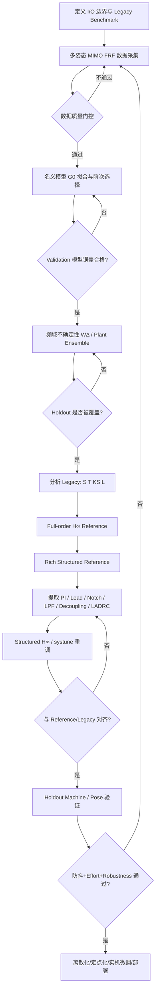
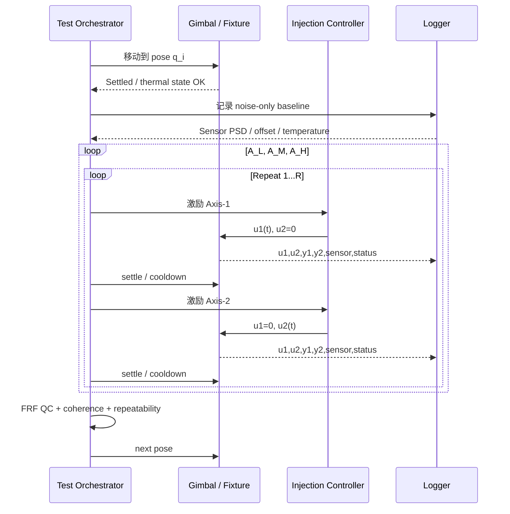

# 从多姿态 MIMO FRF 到可维护防抖控制器的工程化 SOP

## 执行摘要

本 SOP 的目标不是把高阶 \(H_\infty\) 控制器直接部署到产品，而是建立一条可重复的 **“数据 → 名义模型 → 不确定性 → 高性能参考闭环 → 低阶结构发现 → 结构化重调 → legacy 对齐”** 流程。MATLAB 已经提供了这条链路的大部分基础设施：`frd/idfrd`、`tfest/ssest/n4sid`、`ucover/fitmagfrd`、`hinfsyn`、`hinfstruct/systune`、`reducespec`、`robstab/diskmargin` 等。citeturn20view0turn20view1turn20view2turn23search0turn21view2turn22search1turn23search23

推荐采用“双参考”策略：先用 full-order \(H_\infty\) 得到理论性能参考 \(K_{\rm full}\)，再用一个较丰富但可解释的 fixed-structure controller 做结构发现；最终产品控制器只保留少量具有明确物理意义的 PI/lead/notch/LPF/decoupling/LADRC 参数。`hinfsyn` 本身允许高阶控制器，而 `hinfstruct`/`systune` 专门面向固定结构调参；这正好对应“teacher/reference”和“deployable controller”的分工。citeturn21view2turn22search1turn17academia33

整个项目最重要的验收标准不是“拟合误差最小”或“\(\gamma\) 最小”，而是新控制器在**未参与设计的姿态和机器**上，其 LOS 防抖 RMS、PSD、稳态误差、actuator effort、\(S/T/KS\)、带宽、MIMO disk margin 和 uncertainty robust-stability margin 与 legacy controller 达到预先定义的等效/非劣水平。`diskmargin` 对 MIMO 提供比逐环 classical gain/phase margin 更强的稳定裕度分析，而 `robstab` 可用于验证显式不确定模型的最弱稳定裕度。citeturn22search30turn23search16

建议第一版项目不要追求“一步自动生成控制器”，而是先把下面每一个 Stage Gate 自动化；当每一步都能稳定通过后，再逐步把结构选择、权重选择和参数优化自动化。



## 总体架构、边界定义与 Legacy 基线

在开始扫频之前，团队必须先锁定一个非常容易被忽略的问题：

\[
\boxed{\text{究竟在辨识哪个 plant？}}
\]

对于当前云台架构，

\[
\text{Attitude}
\rightarrow J^{-1}(q)
\rightarrow
\text{Angle}
\rightarrow
\text{Speed LADRC}
\rightarrow u,
\]

建议至少保留两套模型边界：

\[
\boxed{
G_v(s,q):
u
\rightarrow
\begin{bmatrix}\omega_1\\\omega_2\end{bmatrix}
}
\]

用于研究 actuator/mechanical/speed dynamics，以及

\[
\boxed{
G_{\rm LOS}(s,q):
u
\rightarrow
\begin{bmatrix}\theta_{\rm LOS,1}\\\theta_{\rm LOS,2}\end{bmatrix}
}
\]

用于最终闭环 anti-shake 性能分析。控制器实际使用的确定性 sensor filter、sample/hold 和 delay 应包括在相应 control-relevant measurement chain 中；随机 sensor noise 应作为独立扰动 \(n\) 建模，而不是通过额外 pole/zero 强行拟合进机械 plant。

对于两轴系统，从一开始就保存完整的

\[
G(j\omega,q)=
\begin{bmatrix}
G_{11} & G_{12}\\
G_{21} & G_{22}
\end{bmatrix}.
\]

MATLAB 的 `frd` 对 MIMO 数据使用 `Ny × Nu × Nf` 的复数数组，并允许在后续维度存放 model array；`SamplingGrid` 还能记录 pose 等每个模型对应的工作点，因此非常适合保存多姿态云台数据。citeturn20view0

**强烈建议建立信号归一化。** 在做任何 MIMO singular-value 或 \(H_\infty\) 优化之前定义

\[
\tilde y=D_y^{-1}y,\qquad
\tilde u=D_u^{-1}u,
\]

其中 \(D_y,D_u\) 分别由允许误差、典型 reference、允许电流/电压/torque 等工程尺度决定。否则不同单位或数值量级会直接改变 singular values，优化器会“偏爱”数值大的通道。

Legacy controller 的角色也要在项目开始时定义清楚。不要把目标写成：

\[
K_{\rm new}\approx K_{\rm legacy}.
\]

正确目标是：

\[
\boxed{
\mathcal P(K_{\rm new})
\approx
\mathcal P(K_{\rm legacy}),
}
\]

其中 \(\mathcal P\) 是闭环性能集合。

对 nominal plant 统一计算：

\[
L=GK,
\]

\[
S=(I+L)^{-1},
\]

\[
T=L(I+L)^{-1},
\]

\[
KS=K(I+L)^{-1}.
\]

如果 uncertainty 放在 input 侧，则应同时计算 input-side sensitivity/complementary sensitivity；MIMO 中矩阵乘法不可交换，因此不能始终把所有鲁棒性条件简化成同一个 \(T\)。

推荐在项目启动时冻结如下 benchmark。

| 类别 | Legacy 基线指标 | 新控制器必须记录 |
|---|---|---|
| Tracking / disturbance | \(\bar\sigma(S)\)、低频 \(S\)、LOS PSD | 相同 disturbance 下逐频率比值 |
| Noise / robustness | \(\bar\sigma(T)\)、高频 roll-off | 峰值、roll-off、resonance 附近变化 |
| Control effort | \(\bar\sigma(KS)\) | RMS、P95、peak、slew、饱和时间 |
| MIMO coupling | \(T_{12},T_{21}\) 或 cross-axis LOS | cross-axis RMS/peak |
| Steady state | static angle offset / constant torque error | mean、95% CI |
| Bandwidth | 每轴 tracking BW + singular-value BW | 与 legacy 的百分比差异 |
| Stability | disk margins | loop-at-a-time + multiloop |
| Robustness | uncertainty robust-stability margin | `robstab` lower bound |
| 防抖最终指标 | LOS RMS、PSD-integrated RMS | 与 legacy 做 paired comparison |
| 复杂度 | legacy blocks/参数数 | order、参数数、CPU、RAM、维护项 |

这里推荐将最终主 KPI 定义为 LOS residual 的加权能量，而不是单一角度 RMS：

\[
J_{\rm LOS}
=
\sqrt{
\int_{\omega_{\min}}^{\omega_{\max}}
W_{\rm shake}^2(\omega)
\Phi_{ee}(\omega)\,d\omega
}.
\]

如果尚无成熟的人体手抖 weighting，则第一版直接使用 legacy 实际 disturbance spectrum 以及产品内部已有防抖评分方法。

**项目级推荐验收思想**是“非劣 + 更易维护”，例如第一版可以定义：

\[
\frac{\mathrm{RMS}_{new}}
{\mathrm{RMS}_{legacy}}
\le1.05
\]

作为核心防抖非劣门槛，同时：

\[
\frac{u_{{\rm RMS,new}}}{u_{{\rm RMS,legacy}}}
\le1.10,
\]

robust margin 不低于设定绝对门槛。这里的 5% 和 10% 是建议的项目起始 tolerance，并非控制理论标准，应根据产品感知门槛和硬件余量修改。

## 多姿态 MIMO FRF 数据采集与质量门控

这一阶段的目的不是获得“很多曲线”，而是建立可以区分下列来源的数据：

\[
\boxed{
\text{repeat noise}
,\ 
\text{pose variation}
,\ 
\text{amplitude nonlinearity}
,\ 
\text{unit-to-unit variation}
}
\]

只有这些因素被分开，后面的 \(W_\Delta\) 才有物理意义。

**Step A — 先做宽频低幅 scout sweep。**

使用一台代表性机器，在 center pose 和两个极端 pose 做低幅 broadband sweep。频率范围至少覆盖：

\[
0.1\sim0.2\times
f_{\rm legacy,BW}
\]

到目标 crossover 以上数倍，并确保覆盖第一、第二个可能影响控制的机械 resonance。

这里不要一开始就追求极高 excitation amplitude。先确定：

- noise floor；
- resonance；
- delay；
- anti-alias/filter cutoff；
- actuator saturation；
- cross-axis channel 的量级。

**Step B — 正式 MIMO acquisition。**

最容易维护、最不容易把输入相关性问题引入 FRF 的实验，是 sequential excitation：

\[
u=
\begin{bmatrix}u_1\\0\end{bmatrix}
\Rightarrow
(G_{11},G_{21})
\]

和

\[
u=
\begin{bmatrix}0\\u_2\end{bmatrix}
\Rightarrow
(G_{12},G_{22}).
\]

在同一次轴激励时始终同步记录两个输出。

若测试时间成为主要瓶颈，第二版可以转向 orthogonal multisine / 不重叠频线 simultaneous MIMO excitation，但这时必须用完整的 input spectral matrix 估计 MIMO FRF，而不能简单对每个通道分别做 \(Y/U\)。

**Step C — 每个 pose 先记录 noise-only baseline。**

在无 injection 时记录：

\[
30\sim60\ {\rm s}
\]

的 gyro/Hall/attitude/control signals，估计 noise PSD。这一数据用于后续 noise weight，而不是 \(G_0\) pole-zero fitting。

**Step D — 三个 amplitude level。**

本 SOP 推荐第一版使用：

\[
A_L,\quad A_M,\quad A_H
\]

大约覆盖典型工作微扰的

\[
0.5\times,\quad1\times,\quad1.5\sim2\times
\]

量级，前提是不进入明显 current/voltage/speed/angle saturation。

重点不是这个比例本身，而是检查：

\[
G(j\omega,A_L)
\approx
G(j\omega,A_M)
\approx
G(j\omega,A_H)?
\]

如果不成立，则说明不能把全部数据简单看成同一个 LTI uncertainty ball。

**推荐实验矩阵如下。** 这是工程起点，不是统计学上的固定标准。

| 阶段 | 机器数 | 姿态 | 幅值 | 重复 | 两轴激励 | 用途 | 数据划分 |
|---|---:|---:|---:|---:|---:|---|---|
| Scout | 1 | 3–5 | 1 | 2 | 是 | 找频带、resonance、SNR | 不进最终模型 |
| 主 identification | 1–2 | 8–12 | 3 | 3 | 是 | pose/amplitude/repeatability | 约 60–70% |
| Model selection | 同批 | 保留 2–3 个 pose | 3 | 3 | 是 | 阶次和结构选择 | 约 15–20% |
| Unit variation | 3–5 | 3–5 个 critical pose | 2 | 2–3 | 是 | machine variation | train/validation |
| Final holdout | 至少 1 台未参与调参机器，或完整 holdout poses | 3–5 | 1–2 | ≥3 | 是 | 最终验证 | 绝不用于调参 |
| 温度/负载 | 视产品需求 | critical poses | nominal | 2–3 | 是 | 环境 variation | 独立 validation |

如果使用 10 poses × 3 amplitudes × 3 repeats，一台机器就是 90 个 operating-condition runs；每个 run 含两次 sequential axis sweep，则为 180 个 axis sweeps。第一版可以先缩小到 5 poses，确认自动化流程后再扩展。

**不要把 validation split 做成随机 frequency-bin split。** 同一条 FRF 的相邻频点高度相关；应该 hold out 完整 sweep、完整 pose，最好最终 hold out 完整 machine。这样才测试“未见工况泛化”。

推荐的数据采集时序如下：



**Step E — 数据质量 Gate。**

建议自动生成每个 run 的 QC report，包括：

\[
\gamma^2_{uy}(\omega),
\]

magnitude/phase repeatability、input PSD、output PSD、saturation flag、temperature drift、packet loss 和 clipping。

本 SOP 推荐把以下数值作为第一版“红黄绿”起点：

| 指标 | Green | Yellow | Red |
|---|---:|---:|---:|
| coherence，control-relevant band | \(>0.9\) | 0.8–0.9 | \(<0.8\) |
| repeat magnitude std | \(<0.5\) dB | 0.5–1 dB | \(>1\) dB |
| repeat phase std | \(<3^\circ\) | \(3–5^\circ\) | \(>5^\circ\) |
| saturation | 0 | isolated | systematic |
| clipping/dropout | 0 | 可追溯 | 不可接受 |

这些阈值是建议项目 Gate，不是普适标准。关键是：**只允许因为明确 instrumentation fault 删除 run**；不能因为它使 uncertainty 变大就把真实极端 plant 当成“outlier”删掉。

幅值线性可以定义一个 band-wise 指标：

\[
D_A=
\max_{\omega\in\Omega_c}
\bar\sigma
\left[
G^{-1}_{A_M}
(G_{A_H}-G_{A_L})
\right].
\]

若 \(D_A\) 在 crossover/resonance 附近远大于 repeat dispersion，就应把 amplitude 纳入 scheduling 或 uncertainty 维度，而不能简单视为 measurement noise。

最终建议用 bootstrap 对 repeat runs 计算每个关键频带 residual envelope 的 95% CI；增加一批 pose/machine 后，如果 control-relevant 频带的上包络变化小于约 10%，可视为第一版 uncertainty dataset 接近收敛。这个 10% 同样是项目建议，而不是数学保证。

保存数据时可直接建立 model array。`frd` 原生支持 MIMO 和额外 model-array 维度，并可通过 `SamplingGrid` 保存 pose 等 operating variables。citeturn20view0

```matlab
% H: Ny x Nu x Nfreq x Ncase complex array
Gfrd = frd(H, w);                 % 建议内部统一使用 rad/s
Gfrd.InputName  = {'u1','u2'};
Gfrd.OutputName = {'y1','y2'};

% Ncase 为一维 model array 时可记录工作点
Gfrd.SamplingGrid.pose1 = pose1(:);
Gfrd.SamplingGrid.pose2 = pose2(:);
```

## 名义模型拟合、阶次选择与可辨识性

这一步的目标不是追求最高 fit%，而是得到：

\[
\boxed{
\text{能够正确描述 control-relevant dynamics 的最小稳定模型}
}
\]

MathWorks 的三条主要路线各有不同角色：`tfest` 直接估计传递函数，适合可解释的 SISO/MIMO channel 模型；`ssest` 可以直接从 time-domain 或 frequency-domain 数据联合估计 state-space MIMO 模型；`n4sid` 用 subspace 方法估计 state-space，并很适合作为阶次筛选或初始化。citeturn20view1turn20view2turn20view3

**Step A — 不要先平均 magnitude/phase。**

如果需要构造 central FRF，应平均复数响应或做加权复数 least-squares：

\[
\bar G(j\omega)
=
\frac{\sum_r w_r(\omega)G_r(j\omega)}
{\sum_r w_r(\omega)},
\]

而不是分别平均 dB magnitude 和 wrapped phase。

更稳健的第一版方案是直接选取一个“中心实测 plant”：

\[
i^\star
=
\arg\min_i
\max_j d(G_i,G_j),
\]

把它作为 nominal seed。这样 nominal 一定对应真实可实现工况。

**Step B — 先识别 delay。**

如果 phase 随频率出现近似线性下降：

\[
\phi(\omega)\approx-\omega\tau+\phi_{\rm dyn}(\omega),
\]

先估计 \(\tau\)，不要让 high-order poles 去模拟纯 delay。`frd` 模型本身支持 I/O transport delay 字段，因此数据结构层面可以显式保留 delay。citeturn20view0

**Step C — 用 shared-state MIMO 模型作为主 nominal。**

对于你这个两轴非正交、存在 cross coupling 的系统，本 SOP 推荐：

\[
\boxed{\texttt{n4sid} \rightarrow \texttt{ssest}}
\]

作为主路线。

第一轮 scan：

\[
n_x=2,3,\ldots,12
\]

通常已经足够判断是否存在明显 order knee；如果 12 阶仍没有收敛，则优先检查 delay、sensor filter、poor coherence 或非线性，而不是立即增加到 30 阶。`ssest` 和 `n4sid` 都支持 frequency-response data；相关工具还提供基于 Hankel singular-value 信息的阶次选择能力。citeturn20view2turn20view3

建议流程：

```matlab
% Gid 可以由 FRD / IDFRD 形式提供给 System Identification Toolbox

candidateOrder = 2:12;

% 先利用 subspace 方法看合理阶次区间
% 交互式/脚本式具体选择可按当前 MATLAB 版本设置
Ginit = n4sid(Gid, nx0);

% 再用 prediction-error/state-space estimation 精修
G0_id = ssest(Gid, nx0);

% 用于控制器设计
G0 = ss(G0_id);
```

**Step D — 同时做一个低阶 `tfest` 解释模型。**

即使最终 synthesis 使用 MIMO state-space，也推荐每个主要 channel 做一个：

\[
2\sim6\text{ poles},\qquad0\sim3\text{ zeros}
\]

的 `tfest` exploratory fit，用来回答：

- 哪个 resonance 来自哪个 channel；
- cross channel 是否近似静态 mixing；
- 是否出现 NMP zero；
- delay 是否一致；
- pole 是否跨 pose 持续存在。

`tfest` 可以直接使用 frequency-response data，而且对 MIMO 情况可指定不同 I/O pair 的 pole/zero 数，因此很适合工程解释；但 channel-by-channel 高阶模型不一定共享物理 modes，所以不建议把它作为唯一的 MIMO robust-synthesis plant。citeturn20view1

```matlab
np = 4;
nz = 2;
Gtf = tfest(GnomFRD,np,nz);
```

**Step E — 用 control relevance，而不是全频平均 error 选模型。**

定义加权验证误差：

\[
J_{\rm fit}
=
\sum_{\omega_k}
w_c(\omega_k)
\left\|
D_y^{-1}
[
G_{\rm val}(j\omega_k)-G_0(j\omega_k)
]
D_u
\right\|_F^2.
\]

推荐：

\[
w_c(\omega)
\]

在以下区域提高：

- 预期 crossover 的 \(0.3\sim3\times\)；
- 主要 resonance；
- phase 快速变化区；
- legacy controller notch/lead 所在频带。

高于 controller 实际作用频带一个数量级的细小模态，除非会引起 aliasing/robustness 问题，否则不应为了 fit% 强行增加模型阶次。

**模型可辨识性 Gate**：

一个 pole/mode 只有同时满足以下几项，才应被视为 control-relevant identified mode：

| 检查 | 通过的典型表现 |
|---|---|
| 跨重复实验 | pole/resonance 位置稳定 |
| 跨模型阶次 | 从 4→6→8 阶仍能找到对应 mode |
| coherence | mode 附近数据可信 |
| MIMO channel | 至少一个通道显著可见 |
| validation | 加入该 mode 明显改善 holdout |
| 参数初始化 | 不同 seed 不会大范围漂移 |

`ssest/n4sid` 的 state-space 路线很适合把多个 MIMO 通道中的共享 dynamics 作为一个状态模态处理，而不是给每个 transfer channel 重复创建 poles。citeturn20view2turn20view3

**名义模型退出标准建议：**

\[
\boxed{
\text{继续加阶带来的 control-band validation improvement}
< 5\%
}
\]

并且主要 resonance frequency、damping、phase delay 在 holdout 上稳定；此外模型必须能够重现实测 plant 的 singular-value shape，而不能只看四个 scalar Bode fits。

拟合方法推荐比较如下：

| 方法 | 最适合 | 优点 | 缺点 | 本项目建议 |
|---|---|---|---|---|
| `tfest` | channel 解释、低阶 transfer function | pole/zero 可读、便于结构提取 | MIMO 高阶时状态重复、共享模态表达差 | 辅助解释 |
| `ssest` | MIMO nominal | joint state-space、适合后续 \(H_\infty\) | 参数不如 TF 直观 | **主推荐** |
| `n4sid` | 快速初模、阶次筛选 | 快、MIMO/subspace 友好 | 最终 precision 常需 refinement | **作为 initializer** |
| `fitfrd` | 纯 FRF rational approximation | 简洁、指定阶次 | identification/statistical 诊断较少 | 快速 prototype |
| 直接 FRD | 无需参数化 | 不引入 fit bias | `hinfsyn` 等 synthesis 需要状态空间 realization | 验证 gold data |

`fitfrd` 可直接用指定阶数的 state-space model 逼近 FRD，适合作为快速替代 rational fit。citeturn23search22

## 频域不确定性建模与覆盖验证

建议同时维护两种 uncertainty representation：

\[
\boxed{\mathcal G_{\rm measured}
=\{G_1,\ldots,G_N\}}
\]

和

\[
\boxed{
G=F_u(G_0,W_\Delta,\Delta).
}
\]

第一种是真实 plant ensemble，第二种是可用于 robust analysis/synthesis 的紧凑数学模型。**不要二选一。**

`ucover` 就是针对这一任务设计的：它比较 nominal model 和 LTI response array 的频率 gap，并拟合 stable, minimum-phase shaping filters；其内部实际上先求频率网格上的最大 gap，再用 `fitmagfrd` 拟合动态 weight。citeturn23search0turn23search19

**Step A — 先画原始 residual，而不是立即运行 `ucover`。**

对 SISO：

\[
E_i^{\rm rel}
=
\frac{G_i-G_0}{G_0}.
\]

对 MIMO，不建议直接逐元素做除法。首先计算归一化 additive residual：

\[
E_i^{\rm add}
=
D_y^{-1}
(G_i-G_0)
D_u,
\]

并画：

\[
\bar\sigma(E_i^{\rm add}).
\]

如果 \(G_0\) 在相关频率可稳定求逆，再检查 input/output relative residual。

这一步的目标是判断 uncertainty 更像：

- relative/multiplicative；
- absolute/additive；
- static parametric；
- dynamic unstructured。

**Step B — 选择 uncertainty topology。**

`ucover` 支持以 nominal model 为中心的 uncertain dynamic cover，包括 input multiplicative 等形式；其 uncertainty block \(\Delta\) 是 unit peak-gain dynamic uncertainty，而 shaping filter \(W\) 决定不同频率的不确定度大小。对于 MIMO，默认一侧 shaping filter 可为对角结构。citeturn23search4

典型选择：

\[
\text{Input multiplicative:}\quad
G=G_0(I+W_1\Delta W_2),
\]

\[
\text{Output multiplicative:}\quad
G=(I+W_1\Delta W_2)G_0,
\]

\[
\text{Additive:}\quad
G=G_0+W_1\Delta W_2.
\]

选择原则建议如下：

| 不确定性类型 | 适用情况 | 风险 |
|---|---|---|
| Input multiplicative | actuator/input-side variation 明显 | MIMO uncertainty orientation 要正确 |
| Output multiplicative | sensor/output-side、relative structural variation | plant zero 附近仍可能放大 |
| Additive | \(G_0\) 某些 channel 很小/有零点 | 对大增益通道可能偏保守 |
| `ureal` 参数 | inertia、gain、resonance 参数有物理范围 | 参数模型开发成本高 |
| Plant ensemble | 不想假设 uncertainty topology | 只覆盖实际采样点 |

对于你的云台，第一版可优先尝试：

\[
\boxed{\text{MIMO output/input multiplicative + measured ensemble}}
\]

并用 additive model 做 sanity check。如果两种形式产生完全不同的 robust conclusions，说明 nominal/uncertainty topology 尚未稳定，不应继续 controller synthesis。

**Step C — 从低阶 \(W_\Delta\) 开始。**

建议：

\[
\text{order}(W_\Delta)=1,2,3
\]

依次尝试，不要第一版就做 6–10 阶 weight。

```matlab
% Parray: 2x2 FRD/LTI model array
% G0    : nominal LTI model

ord = [2 2];                 % 2x2 情况的一个典型起点
[Gunc,info] = ucover(Parray,G0,ord);

Wdelta = info.W1;
```

`ucover` 默认返回一个由 stable, minimum-phase shaping filter 与 unit-gain dynamic uncertainty 组成的 cover；这正是后续 robust analysis 所需的形式。citeturn23search4turn23search19

若希望自己明确控制 uncertainty envelope，则先计算：

\[
e_{\max}(\omega)
=
\max_i
\bar\sigma(E_i(j\omega)),
\]

再构造 magnitude FRD：

```matlab
Eenv = frd(eMax,w);
Wdelta = fitmagfrd(Eenv,2);
```

`fitmagfrd` 会用指定阶数的 stable, minimum-phase state-space 模型逼近 magnitude data，并支持 relative degree、frequency weighting 和 magnitude constraints，因此特别适合做“工程师可读”的 uncertainty weight。citeturn23search5

**Step D — 不要只检查 training coverage。**

定义：

\[
\rho_i(\omega)
=
\frac{\text{observed gap}_i(\omega)}
{\text{modelled uncertainty bound}(\omega)}.
\]

理想：

\[
\rho_i(\omega)\le1.
\]

验收分成：

1. training coverage；
2. unseen-pose coverage；
3. unseen-machine coverage；
4. critical resonance coverage。

本 SOP 建议最终 holdout 中，在控制关键频段不允许存在 unexplained systematic exceedance。如果只有单个孤立 frequency point 超出，应首先排查 FRF estimator/noise；若连续频带超出，必须扩大或重构 uncertainty model。

同时检查 conservatism：

\[
C(\omega)
=
\frac{|W_\Delta(j\omega)|}
{e_{\max}(j\omega)}.
\]

如果 control band 内长期：

\[
C\gg2,
\]

reference controller 很可能会被不必要地压慢。这里的 2 是经验诊断线，而非理论门槛。

**Step E — uncertainty envelope convergence。**

按 acquisition batch 顺序计算：

\[
E_{\max}^{(N)}(\omega).
\]

增加新姿态/机器后若：

\[
\frac{
E_{\max}^{(N+\Delta N)}-E_{\max}^{(N)}
}{
E_{\max}^{(N)}
}
\]

在 crossover/resonance 频带的 bootstrap 95% upper bound 已持续低于约 10%，可以冻结第一版 uncertainty dataset。

不确定性建模方案比较：

| 方法 | 自动化 | MIMO 能力 | 可解释性 | 保守性风险 | 推荐用途 |
|---|---:|---:|---:|---:|---|
| `ucover` | 高 | 高 | 中 | 中 | **默认主路线** |
| residual + `fitmagfrd` | 中 | 需自行设计 | 高 | 可控 | weight 人工审查 |
| 多 plant ensemble | 高 | 高 | 最高 | 对未采样工况无保证 | **始终保留验证** |
| `ureal` 物理参数 | 中低 | 高 | 很高 | 若结构正确较低 | 第二阶段升级 |
| 单一超大 additive weight | 高 | 高 | 低 | 很高 | 不推荐长期使用 |

## 频域参考控制器与结构化优化

这里建议不要只有一个“robust controller”，而是建立两个 reference。

\[
\boxed{
K_{\rm full}
=
\text{高自由度性能参考}
}
\]

以及

\[
\boxed{
K_{\rm rich}
=
\text{富结构、可解释的 architecture reference}.
}
\]

这两者最终都不是必须部署的产品控制器。

经典 \(H_\infty\) state-space synthesis 的基础来自 Doyle–Glover–Khargonekar–Francis 等工作；MATLAB `hinfsyn` 当前默认仍提供基于两 Riccati 方程的算法，也可选择 LMI 方法。官方文档明确列出了 Doyle 等 1989 年的标准 \(H_2/H_\infty\) state-space 解作为算法基础。citeturn21view2 固定结构 \(H_\infty\) 则属于不同的 nonsmooth optimization 范式，Apkarian 与 Noll 的相关工作正是现代 structured controller synthesis 的核心理论路线之一。citeturn17academia33

**Step A — 从 Legacy 推导 weights，不要凭空设计 weights。**

首先画：

\[
\bar\sigma(S_{\rm legacy}),
\quad
\bar\sigma(T_{\rm legacy}),
\quad
\bar\sigma(K_{\rm legacy}S_{\rm legacy}).
\]

然后定义 desired envelopes。

一个标准 sensitivity weight 可以写为：

\[
W_S(s)
=
\frac{s/M_S+\omega_B}
{s+\omega_B A_S}.
\]

它对应：

\[
|S(0)|\lesssim A_S,
\]

高频 sensitivity peak 目标大约由 \(M_S\) 控制。

第一版建议探索范围：

\[
A_S=0.01\sim0.1,
\]

\[
M_S=1.5\sim2.0,
\]

\[
\omega_B
\approx
0.7\sim1.2
\times
\omega_{BW,\rm legacy}.
\]

这些不是 universal tuning rules，而是“从 legacy 附近开始搜索”的建议。

对于 control effort：

\[
W_U
\]

首先应该由物理 actuator scale 得到：

\[
u_{\rm norm}=\frac{u}{u_{\rm allow}},
\]

再根据高频 control action 是否需要额外惩罚决定是否加 frequency dependence。

对于 \(T\)，优先从：

- uncertainty onset；
- sensor-noise PSD；
- mechanical resonance；

三者中最早出现的问题决定 roll-off。

如果是简单 SISO multiplicative uncertainty，small-gain 思路会得到熟悉的

\[
\|W_\Delta T\|_\infty<1.
\]

但 MIMO input/output uncertainty 的确切 channel 取决于 uncertainty placement，必须根据实际 LFT interconnection 构造；不要因为 SISO 公式熟悉就在 MIMO 中直接套用。

**Step B — Full-order benchmark。**

建立 mixed-sensitivity generalized plant：

\[
z=
\begin{bmatrix}
W_SS\\
W_UKS\\
W_TT
\end{bmatrix}
w.
\]

然后：

```matlab
Paug = augw(G0,Ws,Wu,Wt);

ny = size(G0,1);
nu = size(G0,2);

[Kfull,CLfull,gammaFull,info] = hinfsyn(Paug,ny,nu);
```

`hinfsyn` 返回 stabilizing \(H_\infty\)-optimal controller，闭环 `CL` 的 \(H_\infty\) norm 就是返回的 `gamma`；该控制器通常与 augmented plant 拥有相同状态数，所以它天然可能成为不适合产品部署的高阶 controller。citeturn21view2

这里不要强迫：

\[
\gamma=\gamma_{\min}.
\]

MathWorks 官方也特别指出，当最优性能远好于实际需要时，用稍差一点的 target \(\gamma\) 往往能得到 gain 更小、numerical conditioning 更好的 controller。citeturn21view2

因此本 SOP 建议同时保存：

\[
K_{\min}
\]

和

\[
K_{1.1\sim1.3\gamma^\star}.
\]

后者通常更适合作为“teacher”。

**Step C — 检查 Full-order reference 到底学到了什么。**

不要先分析 \(K_{\rm full}\) coefficients，先比较：

\[
L_{\rm full},\quad
S_{\rm full},\quad
T_{\rm full},\quad
K_{\rm full}S_{\rm full}.
\]

重点记录：

- low-frequency loop gain slope；
- crossover；
- phase-boost region；
- resonance notch；
- high-frequency roll-off；
- off-diagonal compensation。

然后与 legacy 叠图。

这一步往往会出现三种结果：

\[
\text{Legacy}\approx\text{Reference},
\]

说明“祖传经验”实际上已接近良好 loop shape；

或者

\[
\text{Reference明显更好且 effort 接近},
\]

说明有真实优化空间；

或者

\[
\text{Reference明显更好但 effort/order 极大},
\]

说明当前 legacy 的限制主要来自产品约束而不是理论设计错误。

**Step D — 再做一个 Rich Structured Reference。**

例如允许：

\[
K_{\rm rich}
=
D_{\rm static}
\cdot
K_{\rm diag}
+
K_{\rm cross,dyn},
\]

其中每个 diagonal channel 可以包含：

\[
PI
\times Lead
\times Notch
\times LPF,
\]

同时允许一个低阶 cross-axis compensator。

如果想保留现有 cascade：

\[
K_{\rm rich}
=
K_{\rm attitude}
\rightarrow
J^{-1}
\rightarrow
K_{\rm angle}
\rightarrow
K_{\rm LADRC}.
\]

`hinfstruct` 正是把 classical \(H_\infty\) 扩展到 fixed-structure control system 的工具；MathWorks 也建议在需求不方便完全写成权重函数时，使用 `systune`/`looptune` 进行更高层的固定结构调参。citeturn22search1

`hinfstruct` 比较适合：

\[
\min_\theta
\left\|
T_{wz}(\theta)
\right\|_\infty.
\]

`systune` 则更适合你的产品 cascade，因为它可以同时表达 soft goals 和 hard goals，例如 tracking、step response、gain constraints 和 margins；其 hard goals 归一化后低于 1 就表示约束已满足。citeturn23search23

推荐：

- **Hard goals**：closed-loop stability、minimum margin、actuator maximum、high-frequency noise。
- **Soft goals**：tracking BW、\(S\) minimization、legacy matching、cross-axis reduction。

Structured \(H_\infty\) 本质是非凸、非光滑优化，因此初始化和多起点很重要；现代 fixed-structure \(H_\infty\) 方法就是通过 nonsmooth optimization 解决这一类问题。citeturn17academia33turn22search1

实际建议对每一个结构做：

\[
10\sim20
\]

个 randomized starts，保留不仅仅 objective 最小，而且参数不过度极端的 Pareto candidate。

**Step E — 明确 LADRC 在结构中的角色。**

如果最终仍保留一阶 LADRC speed loop，把

\[
\theta_{\rm LADRC}
=
[b_0,\omega_c,\omega_o]
\]

直接作为 tunable parameters。

第一版搜索范围可围绕当前 legacy：

\[
b_0\in[0.5,2]\,b_{0,\rm legacy},
\]

\[
\omega_c\in[0.5,1.5]\omega_{c,\rm legacy},
\]

\[
\frac{\omega_o}{\omega_c}
\approx2.5\sim6.
\]

同时施加 cascade separation，例如：

\[
\frac{\omega_{\rm speed}}
{\omega_{\rm angle}}
\gtrsim3,
\qquad
\frac{\omega_{\rm angle}}
{\omega_{\rm attitude}}
\gtrsim2.
\]

这些范围同样应被视为 search box，而不是 LADRC 定理。

推荐不要要求 LADRC ESO 去“主动消掉”高 Q structural resonance；如果 reference 明显在某一个 resonance 附近产生局部 attenuation，优先把它显式翻译成 notch，这通常比靠 observer bandwidth 隐式处理更可维护。

## 参考控制器的结构提取与低阶重构

结构提取时最重要的原则是：

\[
\boxed{
\text{不要拟合 }K_{\rm full}\text{ 本身，优先拟合它产生的闭环行为。}
}
\]

因为完全不同的 controller transfer functions 可能产生近似相同的：

\[
S,\quad T,\quad KS.
\]

**Step A — 先做 controller order analysis。**

对于稳定的 \(K_{\rm full}\)，先看：

- poles/zeros；
- controller Bode；
- Hankel singular values；
- balanced-state contribution。

当前 MATLAB 的 model-order-reduction 工作流可使用 `reducespec` 建立 reduction specification；balanced reduction 的目的正是按照状态对 I/O 行为的贡献识别可删减状态。citeturn21view7

典型框架：

```matlab
R = reducespec(Kfull,"balanced");
R = process(R);

% 检查 Hankel singular value / error tradeoff
view(R,"sigma");

% 根据当前版本 getrom 语法获取 reduced model
Kred = getrom(R,Order=nr);
```

但这里一定要记住：

\[
K_{\rm reduced}\approx K_{\rm full}
\]

并不能保证：

\[
T_{\rm cl,reduced}\approx T_{\rm cl,full}.
\]

所以每降一次阶，必须重新闭环。

**Step B — 按 frequency signature 把 dynamics 翻译成模块。**

| \(K_{\rm ref}\) / loop-shape 特征 | 候选工程模块 |
|---|---|
| DC/high low-frequency gain | I / PI |
| crossover 前相位抬升 | Lead |
| 一段频带 gain 增强 | Lag / PI zero placement |
| resonance 附近局部深衰减 | Notch |
| 高频 \(-20/-40\) dB/dec roll-off | 1st/2nd LPF |
| 两轴近似常数 mixing | Static decoupling matrix |
| off-diagonal 随频率变化 | low-order dynamic decoupler |
| disturbance compensation 类似 low-band inverse | DOB/LADRC component |

真正想得到的是：

\[
\boxed{
K_{\rm deploy}
=
\text{少量明确模块的组合}
}
\]

而不是一个“虽然只有 5 阶，但没人知道每个 state 做什么”的 state-space matrix。

**Step C — 建立结构候选集，而不是只猜一个结构。**

建议至少保留三个 candidate：

\[
\mathcal K_A:
\text{Legacy cascade，只重新调参数}
\]

\[
\mathcal K_B:
D_{\rm static}
+
PI/Lead/Notch/LPF
\]

\[
\mathcal K_C:
D_{\rm static}
+
\text{diagonal loops}
+
\text{一个低阶 dynamic cross compensator}.
\]

然后让数据决定复杂度是否值得。

控制器提取策略比较：

| 策略 | 自动化 | 可维护性 | 保闭环性能能力 | 风险 | 推荐 |
|---|---:|---:|---:|---|---|
| Balanced truncation | 高 | 中 | 中 | 可能破坏闭环 | 初筛 |
| 直接 fit \(K_{\rm ref}\) FRF | 高 | 中 | 中低 | 拟合错目标 | 不作最终方法 |
| Pole-zero → PI/Lead/Notch | 中 | **很高** | 中 | 需工程判断 | **结构发现** |
| 拟合 \(L=GK\) | 中高 | 高 | 高 | plant-dependent | 推荐 |
| 拟合 \(S,T,KS\) | 中 | 高 | **很高** | optimization 较复杂 | **最佳最终策略** |
| 固定结构直接 `systune/hinfstruct` | 高 | **很高** | **很高** | local optimum | **最终推荐** |

**Step D — 用 closed-loop distance 定义结构提取 objective。**

例如：

\[
J_{\rm mimic}(\theta)
=
\max
\left\{
\left\|
W_{mS}
(S_\theta-S_{\rm ref})
\right\|_\infty,
\right.
\]

\[
\left.
\left\|
W_{mT}
(T_\theta-T_{\rm ref})
\right\|_\infty,
\left\|
W_{mU}
(K_\theta S_\theta-K_{\rm ref}S_{\rm ref})
\right\|_\infty
\right\}.
\]

更好的方式甚至不是强制模仿 reference，而是：

\[
\min_\theta
\text{Complexity}(\theta)
\]

subject to

\[
J_{\rm perf}(\theta)
\le
(1+\epsilon)J_{\rm ref}.
\]

这就把你的研究问题正式写成：

\[
\boxed{
\text{在只损失少量 robust-reference 性能的情况下，
寻找最低复杂度控制器。}
}
\]

第一版建议：

\[
\epsilon=5\%\sim15\%
\]

做 Pareto sweep，画：

\[
\text{controller complexity}
\quad\text{vs}\quad
\text{performance loss}.
\]

这张图往往比单纯输出某个 controller 参数更有价值，因为它能告诉团队：“为了最后 3% 的性能，我们究竟增加了多少维护成本？”

## 结构化重调、Legacy 对齐与统计验收

结构一旦确定，就进入真正的 product controller synthesis：

\[
\boxed{
K_{\rm deploy}(s,\theta).
}
\]

此时不再需要保留 full-order reference 的内部状态。

**Step A — 用 Reference 初始化，用 Legacy 定底线。**

初始参数：

\[
\theta_0
\]

来自三个来源：

\[
\theta_{\rm legacy},
\qquad
\theta_{\rm ref-extracted},
\qquad
\theta_{\rm random}.
\]

至少做：

- legacy-start；
- extracted-start；
- 多个 randomized starts。

这样可以判断 optimizer 是否只是回到祖传参数附近，还是确实找到了新的 basin。

**Step B — Structured optimization objective。**

产品版建议最终优化：

\[
J(\theta)=
\max
\{
J_S,
J_T,
J_U,
J_{\rm cross},
J_{\rm legacy}
\}.
\]

其中：

\[
J_S=
\|W_SS\|_\infty,
\]

\[
J_T=
\|W_TT\|_\infty,
\]

\[
J_U=
\|W_UKS\|_\infty.
\]

并增加 cross-axis：

\[
J_{\rm cross}
=
\left\|
W_C
\begin{bmatrix}
0&T_{12}\\
T_{21}&0
\end{bmatrix}
\right\|_\infty.
\]

如果使用 `systune`，可以把必须满足的 actuator/margin/noise 目标作为 hard goals，把 tracking/reference matching 作为 soft goals；`systune` 会在 hard goals 约束下优化 soft goals，并返回各目标的归一化达成程度。citeturn23search23

**Step C — 不要只在 \(G_0\) 上 tune。**

每次 candidate controller 都必须跑：

\[
G_1,\ldots,G_N.
\]

保存：

\[
J_{\max}
=
\max_iJ(G_i,K).
\]

如果优化器只在 nominal 上好看，而在某个真实 pose 上明显恶化，这个 candidate 不能进入部署池。

最终 uncertainty model 还应做显式 robust analysis。`robstab` 能计算 uncertain closed loop 的最弱 robust-stability margin，并可通过 `VaryFrequency` 检查 margin 随频率变化。citeturn23search16

建议内部 Gate 例如：

\[
\boxed{
\text{robust stability margin lower bound}>1.2
}
\]

而不仅仅是 \(>1\)，给建模误差留下额外工程余量。1.2 是本 SOP 的建议初始 target，不是统一行业标准。

MIMO stability margin 同时使用：

```matlab
[DM,MM] = diskmargin(L);
```

其中 `diskmargin` 提供 loop-at-a-time 与 multiloop disk margins，而且官方明确指出 disk-based stability margin 比 classical single-loop gain/phase margin 提供更强的稳定保证。citeturn22search30

因此对于 MIMO 云台：

\[
\boxed{
\text{不要只提交 PM/GM；
必须提交 multiloop disk margin。}
}
\]

**Step D — Legacy A/B 测试必须 paired。**

同一台机器、同一 pose、同一 disturbance trace 下运行：

\[
\text{Legacy}
\rightarrow
\text{New}
\]

并随机化 A/B 顺序，减少温度、SOC、bearing heating 等随时间变化因素。

对每个 test case 保存：

\[
\Delta_{\rm RMS}
=
\frac{RMS_{\rm new}-RMS_{\rm legacy}}
{RMS_{\rm legacy}}.
\]

最终不要只做“新旧差异 p-value”。

对于目标是“对齐 legacy”的项目，更合适的是**等效/非劣判据**。例如定义工程上可接受：

\[
\delta_{\rm LOS}=5\%.
\]

用 machine/pose paired bootstrap 或单侧 95% confidence bound 验证：

\[
\Pr\left(
\frac{RMS_{\rm new}}
{RMS_{\rm legacy}}
\le1.05
\right)
\]

是否达到项目要求。

建议最终 dashboard 至少包括：

| 指标 | 推荐统计量 | Legacy 对齐 Gate 示例 |
|---|---|---|
| LOS RMS | mean + median + paired 95% CI | upper CI \(\le+5\%\) |
| weighted LOS PSD | band integral | upper CI \(\le+5\%\) |
| P95/P99 LOS | paired ratio | 不恶化 >10% |
| steady-state offset | mean ± CI | ≤ legacy + specification |
| settling time | median/P95 | ≤ legacy ×1.1 |
| overshoot | P95 | ≤ legacy / product limit |
| actuator RMS | paired ratio | ≤ legacy ×1.1 |
| actuator peak | P99/max | ≤ hardware guard |
| saturation time | % total test | 不高于 legacy |
| \(\bar\sigma(S)\) peak | worst pose | 不显著变差 |
| \(\bar\sigma(T)\) | worst pose | noise band 不显著增益 |
| \(\bar\sigma(KS)\) | worst pose | actuator band 不显著增加 |
| tracking BW | per-axis + MIMO | legacy 的 90–110% 或项目目标 |
| disk margin | worst multiloop | ≥项目 absolute threshold |
| `robstab` lower bound | worst uncertainty | 建议 >1.2 |
| cross-axis coupling | RMS / \(\|T_{12}\|,\|T_{21}\|\) | ≤ legacy |
| CPU/RAM/order | deterministic | 显著优于 full-order ref |

最终结果建议画两种 Pareto：

\[
\boxed{
\text{LOS RMS}
\quad vs \quad
\text{Actuator RMS}
}
\]

以及：

\[
\boxed{
\text{Robustness Margin}
\quad vs \quad
\text{Controller Complexity}.
}
\]

这比“某个 \(\gamma=0.87\)”更容易让产品团队理解 controller 的真实价值。

## 部署微调、交付物与建议实施节奏

最后阶段要防止一个常见问题：连续域 MATLAB 里非常漂亮的 controller，在 MCU 上因为 sample delay、coefficient quantization、saturation、anti-windup 和 sensor pipeline 不一致而失效。

**Step A — 在最终 synthesis 前冻结真实 digital chain。**

至少固定：

- control sample rate；
- sensor sample rate；
- sensor LPF；
- digital delay；
- command zero-order hold；
- calculation/communication latency；
- saturation；
- rate limiter；
- anti-windup；
- fixed-point / floating-point format。

这些不是“implementation details”，它们属于最终 plant/controller interconnection。

**Step B — 再离散化，而不是最后随手 `c2d`。**

对 notch/lead/crossover-sensitive blocks，检查离散化前后：

\[
K_c(j\omega)
\quad vs \quad
K_d(e^{j\omega T_s})
\]

在控制关键频带是否保持 magnitude/phase。

最高 controller pole/zero 若已经逼近 Nyquist frequency，就不应该靠换 discretization method 补救，而应该降低 bandwidth 或提高 sample rate。

**Step C — 做 SIL/HIL/bench 三层测试。**

推荐顺序：

\[
\text{MATLAB LTI}
\rightarrow
\text{nonlinear simulation}
\rightarrow
\text{SIL}
\rightarrow
\text{HIL}
\rightarrow
\text{single-unit bench}
\rightarrow
\text{multi-unit A/B}.
\]

每一级都运行**同一组 benchmark disturbance traces**，这样性能下降可以定位发生在哪个层级。

**Step D — 部署微调只能是局部微调。**

如果 offline structured optimization 已经完成，实机阶段只允许小范围：

\[
\pm10\%\sim20\%
\]

参数微调，例如：

- notch depth/Q；
- bandwidth；
- LPF corner；
- LADRC \(\omega_c,\omega_o\)；
- static decoupling gain。

如果实机必须把某个参数调 2 倍以上才能工作，应该退回 identification/model/uncertainty 阶段，而不是继续“祖传式”现场调参。

**Step E — 把模型和控制器一起版本化。**

每一个 controller release 应能够追溯到：

\[
\boxed{
\text{dataset ID}
+
G_0\text{ version}
+
W_\Delta\text{ version}
+
\text{weight version}
+
\text{optimization config}
+
\text{firmware version}
}
\]

建议仓库结构直接标准化：

```text
/project
    /data_raw
    /data_frf
    /qc_reports
    /nominal_models
    /uncertainty_models
    /legacy_baseline
    /reference_controllers
    /structured_candidates
    /holdout_validation
    /deployment
    /reports
```

每次 synthesis 输出一个 machine-readable manifest：

```text
controller_id
dataset_hash
G0_id
Wdelta_id
controller_structure
controller_parameters
sample_time
gamma_reference
Ms
Mt
disk_margin
robust_stability_margin
legacy_RMS_ratio
actuator_RMS_ratio
validation_cases_passed
```

**完整 Stage-Gate 建议如下：**

| Gate | 必须回答的问题 | 不通过时回退 |
|---|---|---|
| Data Gate | FRF 是否可信、重复、无 saturation？ | 重做实验 |
| Linearity Gate | amplitude 变化能否视为 LTI uncertainty？ | scheduling/nonlinear modeling |
| Model Gate | \(G_0\) 是否重现 control-relevant modes？ | 修改阶次/delay/model structure |
| Uncertainty Gate | unseen pose/machine 是否被覆盖且不过度保守？ | 重构 \(G_0/W_\Delta\) |
| Reference Gate | 高自由度 controller 能否达到目标？ | 修改性能需求/weights |
| Structure Gate | 简化结构是否只损失可接受性能？ | 增加一个必要模块 |
| Robustness Gate | ensemble + uncertainty margins 是否通过？ | 降 BW / reshape |
| Legacy Gate | 防抖是否统计非劣？ | structured retune |
| Deployment Gate | digital implementation 是否保持性能？ | latency/discretization 修正 |

最终应交付给控制团队的不是一个 `.mat` controller，而是至少以下六项：

1. **MIMO FRF 数据库及 QC report**；
2. **名义模型 \(G_0\) 与 identification/validation report**；
3. **uncertainty model \(W_\Delta\) + holdout coverage report**；
4. **Legacy / full-order reference / structured controller 三方 \(S/T/KS\) 对比**；
5. **real-world anti-shake A/B benchmark 与统计置信区间**；
6. **最终 controller topology、参数、sample-time、部署限制及 regression-test suite**。

当前 MathWorks 工具链已经能够覆盖这条 SOP 的大部分核心环节：`frd` 用于 MIMO/模型数组频响管理；`tfest/ssest/n4sid` 用于参数化辨识；`ucover` 与 `fitmagfrd` 用于频率相关 dynamic uncertainty；`hinfsyn` 用于 full-order \(H_\infty\) benchmark；`hinfstruct` 与 `systune` 用于固定结构优化；`reducespec` 用于 order-reduction 分析；`diskmargin` 和 `robstab` 用于最终 MIMO/uncertain stability verification。citeturn20view0turn20view1turn20view2turn20view3turn23search0turn23search5turn21view2turn22search1turn23search23turn21view7turn22search30turn23search16

优先理论参考上，可以把 **Doyle–Glover–Khargonekar–Francis 的标准 \(H_\infty\) state-space synthesis** 作为 full-order reference 的理论基础；MathWorks `hinfsyn` 文档明确以该经典工作作为核心参考。citeturn21view2 对 fixed-structure 部分，则以 **Apkarian–Noll 的 nonsmooth \(H_\infty\) synthesis** 为核心理论脉络，其意义正是把 \(H_\infty/H_2\) 等优化方法带入工程师预先规定的控制器架构。citeturn17academia33 对 loop-shaping 思想，则建议团队同时阅读 McFarlane–Glover 的经典 *A Loop-Shaping Design Procedure Using \(H_\infty\) Synthesis*；工程上对应的核心思想正是本 SOP 采用的：**先明确需要什么 loop shape 和 robustness，再决定什么低阶结构最经济地实现它。**

最终，这套流程真正要实现的不是

\[
\boxed{
\text{FRF}\rightarrow H_\infty\text{ controller}
}
\]

而是

\[
\boxed{
\text{FRF}
\rightarrow
\underbrace{\text{可验证的性能需求}}_{S,T,KS,\text{robustness}}
\rightarrow
\underbrace{\text{高自由度参考解}}_{\text{teacher}}
\rightarrow
\underbrace{\text{结构发现}}_{\text{PI/Lead/Notch/LADRC/...}}
\rightarrow
\underbrace{\text{低阶结构化最优解}}_{\text{deploy}}
\rightarrow
\underbrace{\text{Legacy 防抖非劣验证}}_{\text{product acceptance}}
}
\]

这才是适合你当前目标的真正 **0→1 控制器生成流程**：legacy 不再负责告诉你“参数应该是多少”，而是作为产品性能基准；robust/\(H_\infty\) controller 不再是最终产品，而是用来告诉你“这个 plant 在频域上真正需要什么”；最后的产品控制器则负责把这些信息压缩成一个工程团队能够理解、标定、版本化和长期维护的结构。