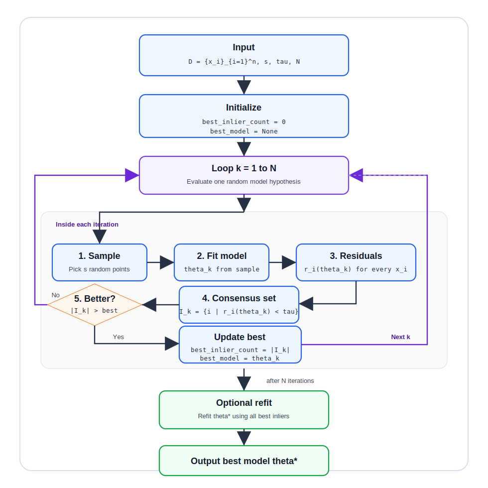

# RANSAC (Random Sample Consensus)

## Overview

RANSAC is a robust estimation method that repeatedly samples minimal subsets, fits a model, and keeps the model with the highest inlier support under a residual threshold.

## Algorithm workflow

## MATLAB demo goals

- Build a modal-fit algorithm demo with user-provided MATLAB code.
- Estimate candidate modal parameters from minimal random samples.
- Use residual thresholding to build a robust consensus set.
- Refit the final modal model using all inliers from the best hypothesis.
- Track this as a this-week plan item in `plan/2026/short_term/2026-W19.md`.
